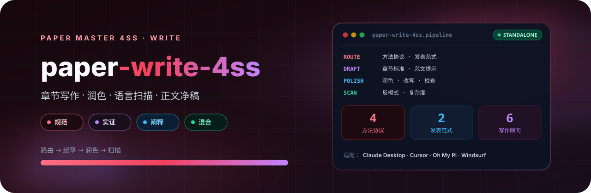

<p align="center">
  
</p>

# Paper 论文写作 4SS

中文社会科学论文写作系统。先通过 research_router.md 完成研究方法协议与发表范式双层路由，再按章节标准和范文提示词完成写作、润色和检查。支持规范研究、实证研究、阐释研究、混合研究四类方法协议，以及社会学研究范式和管理世界案例研究范式两类发表风格。配备 writing_scanner.py 与 complexity_analyzer.py，用于语言反模式扫描和文本复杂度诊断。

## 4SS 家族

| 包 | 职责 |
|---|---|
| [paper-master-4ss](https://github.com/JingYangYuan/paper-master-4ss) | 总控：登记输入、选择模块、维护工作区 |
| [paper-design-4ss](https://github.com/JingYangYuan/paper-design-4ss) | 选题、框架路由、研究设计蓝图 |
| [paper-lit-4ss](https://github.com/JingYangYuan/paper-lit-4ss) | 中英文检索、文献地图、空白与假设 |
| [paper-outline-4ss](https://github.com/JingYangYuan/paper-outline-4ss) | 素材转大纲、证据映射、缺口报告 |
| [paper-analysis-4ss](https://github.com/JingYangYuan/paper-analysis-4ss) | 定量 / 质性 / 混合，Stata · R · Python |
| **[paper-write-4ss](https://github.com/JingYangYuan/paper-write-4ss)**（本仓库） | 章节写作、润色、语言扫描、正文净稿 |
| [paper-submission-4ss](https://github.com/JingYangYuan/paper-submission-4ss) | Word 导出、体例、投稿清单与信函 |
| [paper-update-4ss](https://github.com/JingYangYuan/paper-update-4ss) | 待审核更新包，不直接改核心文件 |

## 它做什么

先经研究方法协议与发表范式双层路由，再按章节标准和范文提示词写作、润色和检查。产出正文净稿（标题层级 + 自然段），过程材料不得拼进正文。

配备 `writing_scanner.py` 与 `complexity_analyzer.py`，用于语言反模式扫描和文本复杂度诊断。

## 路由

| 层 | 选项 |
|---|---|
| 方法协议 | 规范、实证、阐释、混合 |
| 发表风格 | 社会学研究范式 / 管理世界案例研究范式 |

## 安装

将本目录放到宿主的 skill 目录。入口见 `SKILL.md`。

```bash
git clone https://github.com/JingYangYuan/paper-write-4ss.git
```

与 [`paper-master-4ss`](https://github.com/JingYangYuan/paper-master-4ss) 同级安装时，跨模块路径才能解析。只做本模块任务也可以单独使用。

## 与总控的关系

本包由总控 [`paper-master-4ss`](https://github.com/JingYangYuan/paper-master-4ss) 导出；对应源目录是总控包内的 `modules/write/`：

- 包内相对路径相对本包根目录解析
- `master/` 与部分 `references/` 是导出时的协议快照
- 更新方式：修改总控对应模块后重新导出，不要直接改本仓库

## License

[MIT](LICENSE)
