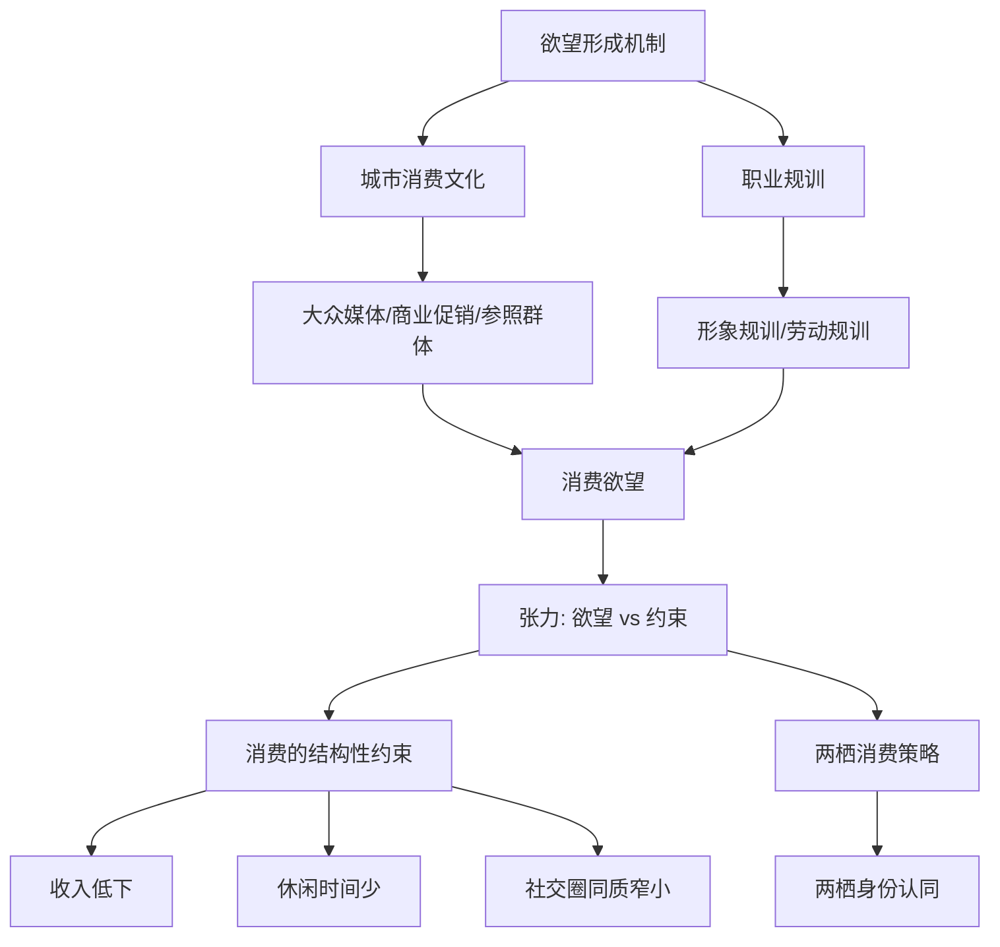

# 第七讲：经验材料的组织——寻找逻辑

## Core Idea
将散乱的材料以一定的逻辑组织起来，使之呈现新意义。关键在于找到"线头"——符合人们认知规律的逻辑框架。四种组织方式殊途同归：共同呈现研究对象的内在逻辑。

## 四种组织逻辑

### 一、时间与空间

**时间逻辑**：
- 天然的线性认知框架——最常用，最自然
- 关键原则：用研究对象自身呈现的**内在时间节点**，而非机械套用政治时间
- 反模式：将所有研究对象的时间节点等同于1949/1966/1978/2012等政治分期
- 另一种时间维度：过去、现在、未来的时间感知（适用于话语分析）

**空间逻辑**：
- 地理转场：东南西北、按行程路线、区域理论
- 社会分层：上中下、由城市到乡村
- 网络层次：大众媒体→地方城市→县域→乡村的人际流动

### 二、事件的发展（事件化/过程化）
- 将抽象研究对象转化为具体事件，分解为前-中-后或起因-经过-结果
- 范例：听金属乐 → "进入现场 → 聆听过程 → 自我认同"三阶段
- 范例：五四运动在乡村 → "传播 → 动员 → 民族主义"三环节
- 5W模式是事件化思维的经典案例

### 三、理论的层次
- 借助开放型理论自带的分析框架组织材料
- 范例：技术的社会建构理论 → 技术知识 → 技术剧本 → 技术意识形态（由表及里）
- 范例：媒介化的四个层次（延伸、替代、融合、适应）——适合局部使用
- 警惕：封闭的框架型理论会削足适履，使所有文章千篇一律（如"可供性三层次"的滥用）
- 原则：框架型理论最多局部使用，不应结构全文

### 四、人为的建构
- 当材料无自然秩序、无现成理论框架时使用
- 必须细致交代划分依据，使之符合认知规律
- 范例：老漂族的微信使用 → 流入地、流出地、返乡中（基于研究对象的空间转换）
- 范例：生活的主题 → 慢节奏、独处、物质自然、象征自然

## 核心原则
四种方式的共性是遵循**研究对象自身展现出来的秩序**。组织逻辑不存在于材料外部，而是藏在材料内部等待被发现。

## Key Takeaways
1. 时间是组织材料最有力的逻辑——但必须是"内在时间"而非"政治时间"
2. "事件化"是将抽象对象转化为可分析结构的通用方法
3. 框架型理论最多在局部使用——全文套用会抹杀特殊性
4. "三段论"（前中后/上中下/因经过）符合人类认知，但非绝对
5. 人为建构需要更多的合理性论证和依据交代

### 经验分析的呈现工具

以下两种工具属于"论证呈现形式"层面，是对四种组织逻辑（时间空间/事件发展/理论层次/人为建构）的辅助，而非组织逻辑本身。

#### 一、表格对比呈现概念差异

适用于两种对立范式/概念/策略的系统比较。先有论证逻辑，再用表格呈现。

**操作**：(1)定义对比维度（行标题）——必须互斥且穷尽关键差异；(2)填充特征（列标题）——简洁准确；(3)表格后附文字解释——不可"以表代文"。

**示例**（王宁《质性远读》表1）：

| 维度 | 量化远读 | 质性远读 |
|------|----------|----------|
| 资料样本 | 大样本、大数据 | 小样本 |
| 距离化方式 | 时间跨距、空间跨距 | 心理距离 |
| 分析方法 | 量化分析、变量简化 | 质性分析、理论升华 |
| 近读远读关系 | 分化 | 交织（近距远读） |
| 哲学基础 | 实证主义 | 释义主义 |

**常见失败**：维度选取不对称（偏向一方）；单元格过于简略（仅"是/否"）；以表代文；维度过多（>10个失去聚焦）。**质量门槛**：对比维度互斥穷尽；单元格简洁准确；表格后必须有解释文字。

#### 二、概念框架图（Mermaid 流程图）

适用于机制分析、因果链、分析框架的可视化呈现。

**操作**：(1)先给出文字版分析框架；(2)再用 Mermaid 图呈现；(3)图后补充关键节点解释。

**与表格的区分**：表格用于静态概念对比；流程图用于动态过程/因果链条。

**示例**（《两栖消费》概念框架，Mermaid 转写）：

**常见失败**：箭头方向错误或反直觉；节点过多（>15个失去可读性）；图中关系与正文脱节；以图代文（图不能替代文字论证）。**质量门槛**：节点5-15个；箭头方向正确；图中每个节点和箭头在正文有对应论述。图中论述结束后应有对关键路径的文字解释。

## Connects To
- **Ch01**: 第一讲已初步介绍四种组织逻辑
- **Ch06**: 材料搜集完成后进入组织阶段
- **Ch08**: 经验分析完成后的理论对话
