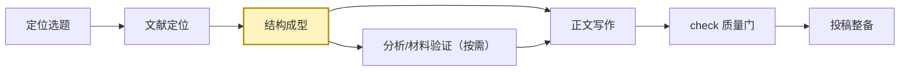

# User Journey Protocol

本协议定义 `paper-master-4ss` 的用户层导航。它不替代 `master/routing-matrix.md`、`master/agent-orchestration.md`、guard 审计或 Rubric 评分，只把内部流程翻译成用户能理解、能决策、能继续推进的论文路径图。

## 1. 论文路径主线

默认把论文项目解释为六个用户可理解阶段：

| 用户阶段 | 对应模块 | 当前目标 | 完成标志 | 常见卡点 | 用户需要提供 |
|---|---|---|---|---|---|
| 定位选题 | `design` | 先确认 FRAME/STORM/DESIGN/FULL 模式与研究取向，再把兴趣变成问题、论题或研究设计方向 | 有确认的取向、FRAME/STORM/DESIGN/FULL 报告与初步设计蓝图 | 取向未定、理论锚点虚、方法不可执行 | 研究兴趣、学科/期刊偏好、可用数据或材料 |
| 文献定位 | `lit` | 找到文献谱系、争议、研究空白及假设或理论对话承接 | 有 `paper-registry.csv` 登记与归档、检索记录、文献地图、`review-evidence.csv` 证据表、gap-map 和假设推导或理论对话包；综述正文按 `master/literature-review-protocol.md` 交接 write | 文献太散、经典文献缺失、空白不够实 | 检索范围、关键词偏好、是否启用 CNKI/Scholar/Zotero |
| 结构成型 | `outline` | 把问题、文献、材料和证据组织成论文结构 | 有论文大纲、证据映射、缺口报告和写作计划 | 章节顺序不稳、证据对不上论点、材料缺口未显化 | 论文类型、字数/期刊要求、已有材料路径 |
| 分析/材料验证 | `analysis`（按需） | 用数据、访谈、文本或案例验证经验主张 | 有分析计划、变量字典/编码方案、真实执行日志、表图和结果摘要 | 数据不可用、模型识别弱、结果不能支撑声称 | 仅实证或混合蓝图交接分析时需要数据路径、变量角色、方法偏好、允许执行的工具 |
| 正文写作 | `write` | 把结构和证据写成可读的论文章节 | 有草稿、修订稿、扫描报告和章节复核；综述任务交付 `05-writing/literature-review.md` 净稿 | 论点不聚焦、文献/结果嵌入生硬、语言过空 | 草稿路径、目标风格、章节优先级、不可改动内容 |
| 投稿整备 | `check` + `submission` | check 是正文写作与投稿整备之间的跨阶段质量门；通过后将稿件整理成投稿包并检查格式/引用/说明文件 | 有审稿报告、问题矩阵、修订清单、Word稿、格式检查、引用缺口、投稿清单和 cover/response letter | 论证/证据未闭环、模板不匹配、引用信息缺失、投稿材料不齐 | 目标期刊、模板、引用体例、投稿材料要求 |

## 2. 常驻路线图

每次启动、继续项目或完成实质模块后，维护：

```text
paper-workspace/_index/paper-roadmap.md
```

`paper-roadmap.md` 必须包含：

````markdown
# 论文路径图

## 当前定位
- 当前阶段:
- 本轮完成:
- 最重要的下一步:
- 暂时不建议做:

## 路径图


## 阶段建议
| 阶段 | 已有基础 | 缺口 | 建议动作 |
|---|---|---|---|

## 回流提醒
- 如果卡在理论: 回到 design/lit
- 如果卡在证据: 回到 outline/analysis
- 如果卡在表达: 回到 write
````

当前阶段的 `class` 必须按实际状态替换：`A`=定位选题，`B`=文献定位，`C`=结构成型，`D`=分析/材料验证，`E`=正文写作，`F`=投稿整备。若阶段不清，先读 `_index/project-state.md`、`_index/handoff-status.md`、`_index/quality-score.json` 和已有产物推断；仍不清时标记为最早的阻断阶段，并说明依据。

## 3. 最终回复导航

每次最终回复必须包含一个终端友好的纯文字路径图，并在图后用 2-4 句中文说明：

- 当前位置：用户现在处于哪个论文阶段，本轮做了什么。
- 推荐下一步：为什么下一步最值得先做。
- 需要用户决定：只列真正会改变路径的选择。
- 暂时不建议做：说明现在跳到后续阶段会带来的风险。

最终回复不要使用 Mermaid 代码块，因为终端和部分文本框无法渲染。使用一行文字箭头，并用 `【当前】` 标记当前位置，例如：

```text
定位选题 -> 文献定位 -> 结构成型 -> 分析/材料验证 -> 【当前】正文写作 -> 投稿整备
```

若当前阶段不清，用 `【当前?】` 标记推断阶段，并在说明中写明依据。`paper-workspace/_index/paper-roadmap.md` 等落盘报告仍可按本协议第 2 节使用 Mermaid。

## 4. 语气规范

- 使用论文导师式语气：温和、具体、诚实，不空泛鼓励，不替用户夸大成果。
- 解释建议时说清“为什么现在做这一步”，避免只给命令式清单。
- 保留不可声称内容、证据缺口和质量风险；风险说明要可行动。
- 用户焦虑或阶段混乱时，先帮其定位，再给一个最小下一步，不一次性压上全流程。
- 用户已经明确目标时，少讲大道理，直接说明当前阶段、输出位置、质量门控和下一步。

## 5. 与索引和评分的关系

- `paper-roadmap.md` 是用户导航索引；`project-state.md` 记录项目事实；`handoff-status.md` 记录阶段交接；`quality-score.*` 记录 Rubric 诊断。
- 实质模块完成后，四者必须同步：路线图解释“怎么走”，项目状态解释“有什么”，交接状态解释“移交什么”，质量分解释“哪里还弱”。
- 旧项目缺少 `paper-roadmap.md` 不阻断交付；下一次启动或实质模块完成时补齐。
